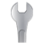

# koishi-plugin-qhzy-sharp

[](https://www.npmjs.com/package/koishi-plugin-qhzy-sharp)

koishi sharp服务的提供，安全使用sharp

## 使用指北

``` typescript
import {} from "@quanhuzeyu/koishi-plugin-qhzy-sharp"  // 导入类型声明
const inject = ["QhzySharp"]  // 使用koishi的inject来确保服务加载后再启动本模块
function apply(ctx: Context) {
    const Sharp = ctx.QhzySharp.Sharp  // 获取原生Sharp
}

```
